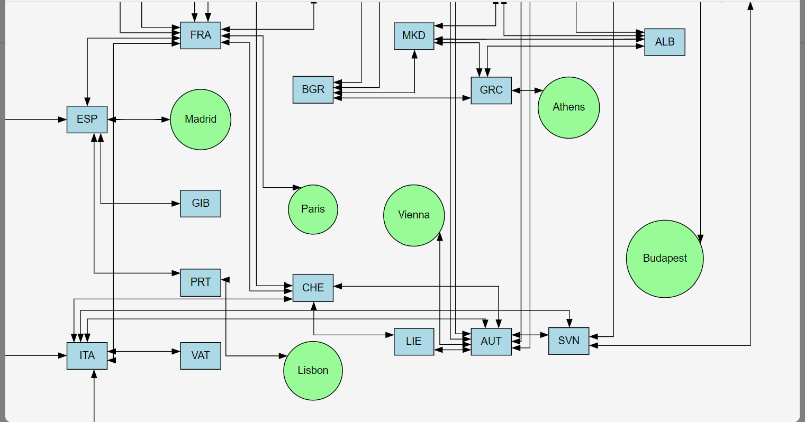
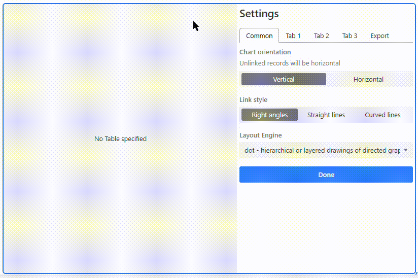
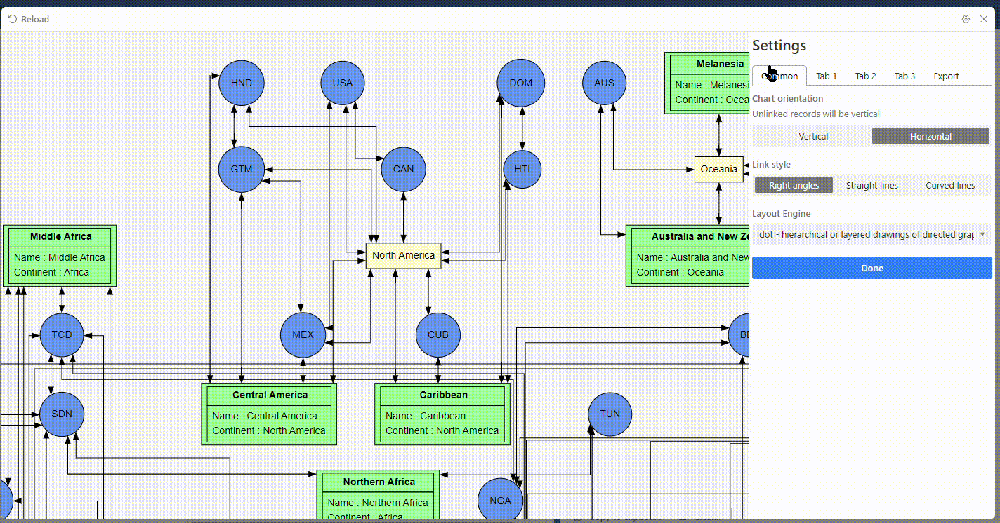
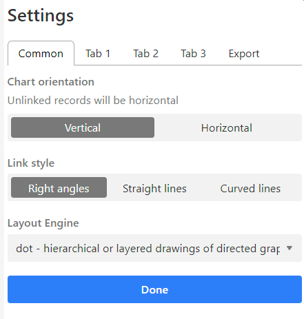
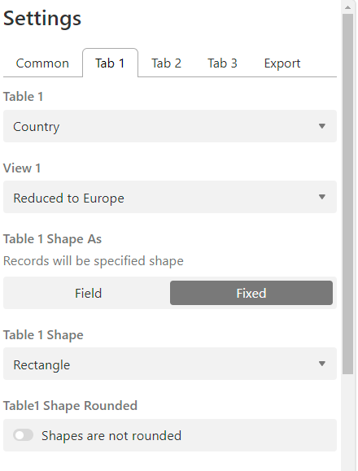
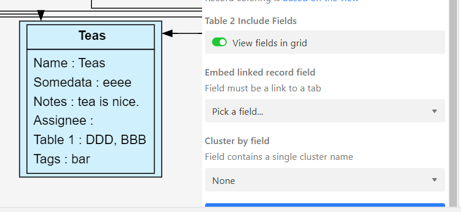

# Tab_graph app

Visualize linked records as graph, such as a flowchart, decision tree, or user flow diagram. Export your
graph to SVG for further editing or PNG for sharing.

Display your airtable data as nodes on a canvas, with links between your nodes being displayed as lines between the shapes. Data from multiple tabs can be displayed on the same canvas. The shape displayed and its colour can either be fixed or driven from field information. You can restrict which nodes and links are displayed by creating Airtable views. You can click on any node on the canvas and open the row edit dialogue. You can choose between several GraphViz layout engines to get different output effects and styles that meet your needs.

# Example usage

**single table display** an example of displaying a single table as shapes.

**mutiple table display** an example of displaying three tables with an embedded link table.

**row edit** you can click on any shape and edit the row for that table.

# Settings
## Common

**chart orientation** - controls the defualt GraphViz layout direction.

**link style** - control how connecting lines are displayed.

**layout engine** - try out different GraphViz [layout engines](https://graphviz.org/docs/layouts/) 

## Tabs 1-3

You can configure beteween 1 and 3 tabs to be displayed as nodes on a canvas. Each tab has the same options:

**Table X** - select a table from your base.

**View X** - select a view for the table selected above. Only rows and fields included in the view will be displayed on the output canvas.

**Table X Shape As** - select a either field or fixed. If you select field then a dropdown will be displayed below containing the field names in the the table that could contain shapes.

If you select fixed then a dropdown will be displayed below that contains some of the supported GraphViz node shapes.

**Table X Shape Rounded** - for some many shapes you can have a rounded cornered version of the shape.

**Table X Colour By** - select a either fixed or record. If you select 'fixed' then a entry field will be displayed below where you can enter a colour name from [this list](https://graphviz.org/doc/info/colors.html#svg). If you select 'Record' then the shape will be the same colour as the Airtable record colour for the selected view.

**Table 2 Include Fields** - if toggled to true, the shapes will contain a table of field names and field values.

**Embed linked record field** - Where a table has a link to another table, you can choose to embed the other tables data within the data for this record. This feature is especially useful when the links to a target table are stored in a linked table.

**Embed linked record field view** - Select a view on the embedded linked record table. The rows included in the view will be used to enhance the data of this table.

**Cluster by field** - If you want to cluster shapes together then you can select a field on the table, the value in the field will be used to cluster the records togther on the canvas.

## Export

You can export the current chart canvas view as either a .png or .svg files.

## How to remix this app

1. Download the source from [Git](https://github.com/davidastephenson/airtable_tab_graph) 

2. Create a new base (or you can use an existing base).

3. Create a new app in your base (see [Create a new app](https://airtable.com/developers/blocks/guides/hello-world-tutorial#create-a-new-app)),
   selecting "Remix from Github" as your template.

4. From the root of your new app, run `block run`.
